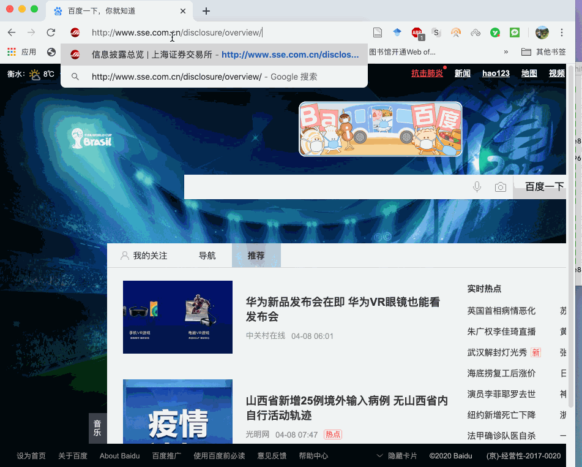

## 一、简介

```
上海证券交易所上市公司定期报告下载,项目地址 https://github.com/thunderhit/shreport
```

- github地址 https://github.com/hidadeng/shreport
-  pypi地址 https://pypi.org/project/shreport


能：

1. 获取上证交易所所有公司目录

2. 上市公司历年报告(季报、半年报、年报)

    
<br>


**使用演示视频**
[B站:如何用Python批量下载上交所上市公司的年报pdf文件](https://www.bilibili.com/video/BV15A411h7RJ)

<br>

<br>


## 二、安装

```
pip install shreport
```

<br>
<br>


## 三、功能说明

```
companys()
  上证所有上市公司名录，公司名及股票代码
  :return: 返回DataFrame

pdfurls(code)
  仅获取定期报告pdf下载链接
  :param code:  股票代码
  :return: 年报pdf链接
  
disclosure(self, code)
   获得该公司的股票代码、报告类型、年份、定期报告披露日期、定期报告pdf下载链接, 返回DataFrame
  :param code:  股票代码
  
  
download(code, savepath)
  下载该公司（code）的所有季度报告、半年报、年报pdf文件
  :param code:  上市公司股票代码
  :param savepath:  数据存储所在文件夹的路径，建议使用相对路径
 
```

<br>
<br>


## 四、快速入门

一定要先获得cookies后才能使用下面的所有代码，这里先直接看代码使用情况，cookies获取可见文档    

<br>
<br>


## 五、获取cookies**

### 4.1  获取上证交易所上市公司目录

```python
from shreport import SH

cookies = {"Cookie": '您的cookies'}
sh = SH(cookies)
df = sh.companys()

#将查询结果存储
#df.to_excel('上证交易所上市公司名录.xlsx')

#显示前5条数据
df.head()
```

Run

| name     | code   |
| :------- | :----- |
| 浦发银行 | 600000 |
| 白云机场 | 600004 |
| 东风汽车 | 600006 |
| 中国国贸 | 600007 |
| 首创股份 | 600008 |


<br>


### 4.2下载某公司所有定期报告文件

绝大多数报告文件名格式

| 文件   | 文件名             | 例子                                 |
| ------ | ------------------ | ------------------------------------ |
| 季度报 | 公司代码-年份-数字 | 600000-2000-1.pdf、600000-2000-3.pdf |
| 半年报 | 公司代码-年份-z    | 600000-2000-z.pdf                    |
| 年报   | 公司代码-年份-n    | 600000-2000-n.pdf                    |

代码

```python
from pathlib import Path
from shreport import SH

cookies = {"Cookie": '您的cookies'}
sh = SH(cookies)
#获取当前代码所在的文件夹路径
cwd = Path().cwd() 
#以浦发银行为例股票代码600000
sh.download(code='600000', savepath=cwd)
```

Run

```
=======请耐心等待，正在获取600000数据
=======准备获取600000年报文件链接========
=======年报文件链接已获取完毕=============
已成功下载600000_2000_1.pdf
已成功下载600000_2000_z.pdf
已成功下载600000_2000_3.pdf
已成功下载600000_2000_n.pdf
......
已成功下载600000_2019_1.pdf
已成功下载600000_2019_z.pdf
已成功下载600000_2019_3.pdf
已成功下载600000_2000_n.pdf
```

<br>


### 4.3 获取某公司的所有定期报告相关信息

如果暂时不想下载定期报告pdf文件，可以可以先获取某公司的

- 股票代码
- 报告类型
- 年份
- 定期报告披露日期
- 定期报告pdf下载链接

结果返回DataFrame

```python
from shreport import SH

cookies = {"Cookie": '您的cookies'}
sh = SH(cookies)


#获取浦发银行披露信息
df = sh.disclosure(code='600000')

#存储数据
#df.to_excel('600000.xlsx')

#前5条信息
df.head()
```

Run

| company  | code   | type         | year | date       | pdf                                                          |
| :------- | :----- | :----------- | :--- | :--------- | :----------------------------------------------------------- |
| 浦发银行 | 600000 | 半年报       | 2000 | 2000-07-28 | http://www.sse.com.cn/disclosure/listedinfo/announcement/c/600000_2000_1.pdf |
| 浦发银行 | 600000 | 第三季度季报 | 2002 | 2002-10-30 | http://www.sse.com.cn/disclosure/listedinfo/announcement/c/2002-10-30/600000_2002_3.pdf |
| 浦发银行 | 600000 | 半年报       | 2002 | 2002-08-17 | http://www.sse.com.cn/disclosure/listedinfo/announcement/c/2002-08-17/600000_2002_z.pdf |
| 浦发银行 | 600000 | 第一季度季报 | 2002 | 2002-04-27 | http://www.sse.com.cn/disclosure/listedinfo/announcement/c/600000_2002_1.pdf |
| 浦发银行 | 600000 | 年报         | 2001 | 2002-03-21 | http://www.sse.com.cn/disclosure/listedinfo/announcement/c/600000_2001_n.pdf |

<br>


### 4.4 获取某公司的所有定期报告url

如果暂时不想下载定期报告pdf文件，可以只得到该公司所有的报告文件链接


```python
from shreport import SH

cookies = {"Cookie": '您的cookies'}
sh = SH(cookies)
#以浦发银行为例股票代码600000
urls = sh.pdfurls(code='600000')
urls
```

Run 

```
=======准备获取600000年报文件链接========
=======年报文件链接已获取完毕=============
['http://www.sse.com.cn/disclosure/listedinfo/announcement/c/600000_2000_1.pdf',
 'http://www.sse.com.cn/disclosure/listedinfo/announcement/c/2002-10-30/600000_2002_3.pdf',
 'http://www.sse.com.cn/disclosure/listedinfo/announcement/c/2002-08-17/600000_2002_z.pdf',
 .......
 'http://www.sse.com.cn/disclosure/listedinfo/announcement/c/600000_2002_1.pdf',

 'http://www.sse.com.cn/disclosure/listedinfo/announcement/c/2019-03-26/600000_2018_n.pdf',
 'http://www.sse.com.cn/disclosure/listedinfo/announcement/c/2018-10-31/600000_2018_3.pdf',
 'http://www.sse.com.cn/disclosure/listedinfo/announcement/c/2018-08-30/600000_2018_z.pdf',
 'http://www.sse.com.cn/disclosure/listedinfo/announcement/c/2018-04-28/600000_2017_n.pdf',
 'http://www.sse.com.cn/disclosure/listedinfo/announcement/c/2018-04-28/600000_2018_1.pdf']

```

<br>

<br>


## 五、获取cookies

一定要先获得cookies后才能使用所有的代码，获取方法

1. 浏览器访问http://www.sse.com.cn/disclosure/overview/
2. 按F12（mac按option+command+I)打开开发者工具的Network
3. 刷新网页，耐心寻找与www.sse.com.cn有关的任意网址，找到cookies




<br>

<br>


# 如果

如果您是经管人文社科专业背景，编程小白，面临海量文本数据采集和处理分析艰巨任务，可以参看[《python网络爬虫与文本数据分析》](https://ke.qq.com/course/482241?tuin=163164df)视频课。作为文科生，一样也是从两眼一抹黑开始，这门课程是用五年时间凝缩出来的。自认为讲的很通俗易懂o(*￣︶￣*)o，

- python入门
- 网络爬虫
- 数据读取
- 文本分析入门
- 机器学习与文本分析
- 文本分析在经管研究中的应用

感兴趣的童鞋不妨 戳一下[《python网络爬虫与文本数据分析》](https://ke.qq.com/course/482241?tuin=163164df)进来看看~

[](https://ke.qq.com/course/482241?tuin=163164df)

<br>


# 更多

- [B站:大邓和他的python](https://space.bilibili.com/122592901/channel/detail?cid=66008)

- 公众号：大邓和他的python

- [知乎专栏：数据科学家](https://zhuanlan.zhihu.com/dadeng)

<br>


